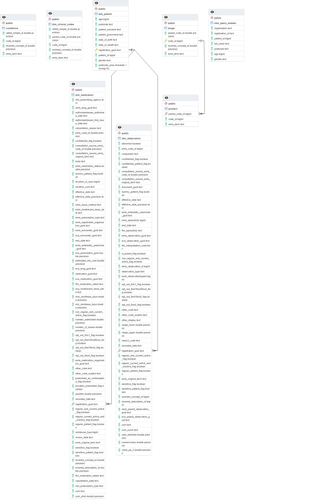

# EMIS Technical Assessment

# Project Description

The EMIS Technical Assessment project aims to demonstrate the ability to design scalable, usable and readable SQL code. The primary objectives include identifying patient by area using their postcodes and deriving a list of eligible patients for a local research study based on specific medical criteria.

In the /root (EXA-DATA_ANALYST_ASSESSMENT) folder, the [main.py](main.py) file runs the various methods shown below that perform a conbination of the Extract, Transform, and Load (ETL) process for the 4 tables.

```python
if __name__ == "__main__":
    
    try:
        print("################################################## Medication Extraction ##################################################")

        medication_df = medication_extraction()

        print("################################################## Observation Extraction and Transformation ##################################################")

        observation_df = observation_extraction_transformation()

        print("################################################## Clinical Codes Extraction ##################################################")

        clinical_codes_df = clinical_extraction()

        print("################################################## Patient Extraction ##################################################")

        patient_df = patient_extraction()

        print("################################################## Upload to postgresSQL (pgAdmin4) ##################################################")

        # List of DataFrames and their corresponding table names
        df_list_to_upload = [
            {"dataframe": medication_df, "table_name": "dim_medication"},
            {"dataframe": observation_df, "table_name": "dim_observation"},
            {"dataframe": clinical_codes_df, "table_name": "dim_clinical_codes"},
            {"dataframe": patient_df, "table_name": "dim_patient"}
        ]
                
        # Upload DataFrames to PostgreSQL
        data_connector.upload_list_to_db(df_list_to_upload, engine = postgres_engine)

        print("################################################## ETL completed ##################################################")

    except FileNotFoundError as e:
        print(f"Error: {e}")
    except ValueError as e:
        print(f"Value Error: {e}")
    except Exception as e:
        print(f"An unexpected error occurred: {e}")
```

The methods within the `main.py` script utilises the `data_cleaning.py`, `data_extraction.py` and `database_utils.py` files and imports the DataCleaning, DataExtractor, and DatabaseConnector classes and uploads the clean data to the centralised database (`emis_data_analysis`) to complete the ETL pipeline. The combined .csv files were too large to upload to GitHub but data uploaded into Panda DataFrames and uploaded to postgreSQL. An issue was noted during the combining of .csv files from the `data\observation` folder. A warning in the terminal showed index column 2 to have mixed data types that could lead to issues with quries later and thus cleaned inline with the ETL process. Also only the unnumbered .csv files in `data\observation` and  `data\medication` .csv files contained the column headers. This was noted and a method created to deal with this during the .csv file combining phase.

After the `main.py` execution, various tables were created, updated and altered followed by creation of the schema ([_02_sql_files/_02_schema.sql](_02_sql_files/_02_schema.sql)) and its `ERD` (see Milestone 3). A link to the clinical_codes_df was not possible with the 4 tables stored in the database and so this table required normalisation into 3 smaller tables; drugs, products and conditions. From these links and tables joins could be made throughout the tables to then perform the required queries. 

The [SQL](_02_sql_files/_03_sql_queries.sql) query (Q3) provided performs analysis of patient data based on specific criteria to give **56 rows** (**56 different patients**). It filters patients with asthma who meet various conditions regarding medication, smoking status, weight, COPD diagnosis and consent to share data.

Here's a summary of the query:

```sql
WITH patient_counts AS (
	SELECT 
		p.patient_id,
		p.postcode_area,
		p.gender,
		COUNT(*) AS number_of_patients,
		SUM(COUNT(*)) OVER (PARTITION BY p.postcode_area) AS total_patients_per_postcode
	FROM 
		dim_patient AS p
	GROUP BY 
		p.postcode_area, 
		p.gender,
		p.patient_id
),
ranked_postcode_areas AS (
    SELECT 
		pc.patient_id,
        pc.postcode_area,
		pc.gender,
		pc.number_of_patients,
        pc.total_patients_per_postcode,
        DENSE_RANK() OVER (ORDER BY pc.total_patients_per_postcode DESC) AS postcode_rank
    FROM 
        patient_counts AS pc
),
top_areas AS (
	SELECT 
		rpa.patient_id,
		rpa.postcode_area,
		rpa.gender,
		rpa.number_of_patients,
		rpa.total_patients_per_postcode,
		rpa.postcode_rank
	FROM 
		ranked_postcode_areas AS rpa
	WHERE 
		rpa.postcode_rank <= 2
	ORDER BY 
		rpa.postcode_rank
),
list_of_patient_criteria AS (
	SELECT 
		o.consultation_source_emis_original_term AS o_consultation_source_emis_original_term,		-- >>>>>>>>>>NOTE:Need to confirmed with mananger in terms of organisation
		p.patient_id,
		m.emis_code_id AS med_emis_code_id,
		m.authorisedissues_authorised_date AS m_authorisedissues_authorised_date,		
		prd.code_id AS prd_code_id,
		d.code_id AS d_code_id,
		d.snomed_concept_id AS d_snomed_concept_id,
		o.emis_original_term AS o_emis_original_term,
		c.code_id AS c_code_id,
		c.refset_simple_id AS c_refset_simple_id,
		c.emis_term AS c_emis_term,
		c.snomed_concept_id AS c_snomed_concept_id
	FROM 
		dim_patient AS p
	JOIN 
		dim_medication AS m
	ON 
		p.registration_guid = m.registration_guid
	JOIN 
		product AS prd
	ON 
		m.emis_code_id = prd.code_id
	JOIN 
		drugs AS d
	ON 
		prd.parent_code_id = d.code_id
	JOIN 
		dim_observation AS o
	ON 
		p.registration_guid = o.registration_guid
	JOIN 
		conditions as c
	ON 
		o.emis_code_id = c.code_id
	WHERE 
		-- patients should have:

		c.refset_simple_id = 999012891000230104 AND 			-- has asthma 
		c.emis_term NOT ILIKE '%Asthma resolved%' AND 			-- and asthma not resolved >>>>>>>>>>NOTE: need to confirm with manager
		m.authorisedissues_authorised_date::date >= (CURRENT_DATE - INTERVAL '30 years') AND		-- in the last 30 years only >>>>>>>>>>NOTE:Need to confirmed with mananger. Is the correct column selected?
		(d.code_id, d.snomed_concept_id) IN (
			(591221000033116, 129490002), 						-- Formoterol Fumarate
			(717321000033118, 108606009), 						-- Salmeterol Xinafoate
			(1215621000033114, 702408004), 						-- Vilanterol
			(972021000033115, 702801003), 						-- Indacaterol
			(1223821000033118, 704459002) 						-- Olodaterol
		) AND

		-- AND to exclude if:
		c.refset_simple_id != 999004211000230104 AND 				-- exclude if current smoker
		-- c.emis_term NOT ILIKE '%smoker%' AND 					-- not a smoker >>>>>>>>>>NOTE: Need to confirm with manager. No such refsetid 999004211000230104 found so filtered on term to be excluded --> Currently a smoker i.e.  have current observation with relevant clinical codes from smoker refset (refsetid 999004211000230104)
		c.snomed_concept_id != 27113001 AND 						-- currently weigh less than 40 kg 
		c.refset_simple_id != 999011571000230107 AND				-- exclude COPD diagnosis that shows unresolved >>>>>>>>>>NOTE: Need to confirm with manager. All filtered comments suggest unresolved. No comments about being 'resolved' found. Maybe add a filter to such output to exclude if 'resolved' asssicated with such a code?
		-- c.emis_term NOT ILIKE '%COPD%' AND 						-- and COPD not resolved >>>>>>>>>>NOTE: Need to confirm with manager. No such refsetid 999011571000230107 found so filtered on term to be excluded --> Should not currently have a COPD diagnosis i.e. have current observation in their medical record with relevant clinical codes from COPD refset (refsetid 999011571000230107), and not resolved.
																-- >>>>>>>>>>NOTE: need to address whether the COPD is resolved or not as this has not been defined

		-- only patients that have not opted out of taking part in research or sharing their medical records (searched using DISTINCT on colomun to see possible entries)

		o.emis_original_term NOT ILIKE '%Declined consent for researcher to access clinical record%' AND  			-- >>>>>>>>>>NOTE:Need to confirmed with mananger
		o.emis_original_term NOT ILIKE '%Declined consent to share patient data with specified third party%' AND 
		o.emis_original_term NOT ILIKE '%No consent for electronic record sharing%' AND 
		o.emis_original_term NOT ILIKE '%Refused consent for upload to local shared electronic record%'
),
patient_with_non_null AS (
    SELECT DISTINCT
        lpc.patient_id
    FROM 
        list_of_patient_criteria AS lpc
    WHERE 
        lpc.o_consultation_source_emis_original_term IS NOT NULL
),
filtered_patient_criteria AS (
    SELECT DISTINCT
        lpc.patient_id,
        lpc.o_consultation_source_emis_original_term
    FROM 
        list_of_patient_criteria AS lpc
    LEFT JOIN 
        patient_with_non_null AS pnn 
    ON 
        lpc.patient_id = pnn.patient_id
    WHERE 
        pnn.patient_id IS NULL OR lpc.o_consultation_source_emis_original_term IS NOT NULL
),
-- organisation, registration id, patient id, full name, postcode, age, and gender.
query_answer AS (
	SELECT DISTINCT
	fpc.o_consultation_source_emis_original_term AS o_fpc_organisation,
	p.registration_guid AS p_registration_id,
	p.patient_id AS p_patient_id,
	p.patient_givenname || ' ' || p.patient_surname AS p_full_name,
	p.postcode AS p_postcode,
	p.age AS p_age,
	p.gender AS p_gender
FROM 
	dim_patient as p
JOIN 
	list_of_patient_criteria as lpc
ON
	p.patient_id = lpc.patient_id
JOIN
	patient_counts as pc
ON 
	lpc.patient_id = pc.patient_id
JOIN
	ranked_postcode_areas as rpa
ON
	pc.patient_id = rpa.patient_id
JOIN
	top_areas as ta
ON
	rpa.patient_id = ta.patient_id
JOIN 
    filtered_patient_criteria AS fpc
ON
    p.patient_id = fpc.patient_id

ORDER BY
	p_postcode,
	p_full_name,
	p_patient_id,
	o_fpc_organisation,
	p_age,
	p_gender
)
-- organisation, registration id, patient id, full name, postcode, age, and gender.
SELECT DISTINCT
	a.o_fpc_organisation AS organisation,
	a.p_registration_id AS registration_id,
	a.p_patient_id AS patient_id,
	a.p_full_name AS full_name,
	a.p_postcode AS postcode,
	a.p_age AS age,
	a.p_gender AS gender
FROM 
	query_answer AS a;

```
Comments can be seen throughout the above query for discussion with the manager; together with suggestions where needed for clarity. The main query answer to Q3 has been saved as [Q3.csv](Q3.csv). Duplicate unessessary files were found in this final query so additional CTE tables were created to help filter away noise/duplicate unessessary data. All investigations of the SQL can be found in a combination of cleaning*.ipynb files for each table, [_02_sql_files/_01_preliminary_investigations_in_pgadmin.sql](_02_sql_files/_01_preliminary_investigations_in_pgadmin.sql), [_02_sql_files/_04_validity_check_of_overall_query.sql](_02_sql_files/_04_validity_check_of_overall_query.sql) and the main query itself [_02_sql_files/_03_sql_queries.sql](_02_sql_files/_03_sql_queries.sql). You will find comments where required and sensible variable names, a number of CTEs and some trial and error along the way to come to the final query searches. One thing to note was the lack of clarity with regard to `refset_simple_id` column typically found in clinical_codes DF. 

Overall things to check/discuss with manager before confirming final production query code:

```sql
list_of_patient_criteria AS (
	SELECT 
		o.consultation_source_emis_original_term AS o_consultation_source_emis_original_term,		-- >>>>>>>>>>NOTE:Need to confirm with mananger in terms of organisation

        (m.authorisedissues_authorised_date::date >= (CURRENT_DATE - INTERVAL '30 years')) AS m_authorisedissues_authorised_date_lessthanequalto_30years, -- check authorisedissues_authorised_date

        c.refset_simple_id != 999011571000230107 AND				-- exclude COPD diagnosis that shows unresolved >>>>>>>>>>NOTE: Need to confirm with manager. All filtered comments suggest unresolved. No comments about being 'resolved' found.

		o.emis_original_term NOT ILIKE '%Declined consent for researcher to access clinical record%' AND  			-- >>>>>>>>>>NOTE:Need to confirmed with mananger
		o.emis_original_term NOT ILIKE '%Declined consent to share patient data with specified third party%' AND 
		o.emis_original_term NOT ILIKE '%No consent for electronic record sharing%' AND 
		o.emis_original_term NOT ILIKE '%Refused consent for upload to local shared electronic record%'
```
```sql
)
-- organisation, registration id, patient id, full name, postcode, age, and gender.
SELECT DISTINCT
	(lpc.c_refset_simple_id::bigint) AS c_lpc_refset_simple_id,						-- refset check >>>>>>>>>>NOTE: Need to confirm with manager. The numbers seem all the same and doesn't make sense
	(cc.refset_simple_id::bigint) AS cc_refset_simple_id_bigint,					-- refset check >>>>>>>>>>NOTE: Need to confirm with manager.joined to dim_clinical_codes with refset_simple_id cast to bigint to cross ref with c_lpc_refset_simple_id
	cc.refset_simple_id AS cc_refset_simple_id_double_precision,					-- refset check >>>>>>>>>>NOTE: Need to confirm with manager.joined to dim_clinical_codes with refset_simple_id left as double precision to cross ref with c_lpc_refset_simple_id							
```


## Project Tasks

- **Part 1: Patients by Area using Postcode**
    - Identify the number of patients in each postcode area.
    - Review patient counts by gender to ensure sufficient gender distribution.
- **Part 2: Identifying Eligible Patients for Research Study**
    - Select the 2 most suitable postcode areas based on patient count.

    - Derive a list of patients meeting the following criteria:
        - Current Asthma Diagnosis:
            - Must have a current observation in their medical record with relevant clinical codes from the asthma refset (refsetid 999012891000230104) and **not resolved**.
            - Diagnosis must be current and not resolved.
        - Prescribed Specific Medications:
            - Must have been prescribed any medication containing the following ingredients in the last 30 years:
            - Formoterol Fumarate (codeid 591221000033116, SNOMED concept id 129490002)
            - Salmeterol Xinafoate (codeid 717321000033118, SNOMED concept id 108606009)
            - Vilanterol (codeid 1215621000033114, SNOMED concept id 702408004)
            - Indacaterol (codeid 972021000033115, SNOMED concept id 702801003)
            - Olodaterol (codeid 1223821000033118, SNOMED concept id 704459002)
        - Exclusion Criteria:
            - Patients who are current smokers (have current observation with relevant clinical codes from smoker refset (refsetid 999004211000230104)).
            - Patients who currently weigh less than 40kg (SNOMED concept id 27113001).
            - Patients with a current COPD diagnosis (have current observation in their medical record with relevant clinical codes from COPD refset (refsetid 999011571000230107)and not resolved.)
        - Opt-Out Criteria:
            - Only include patients who have not opted out of taking part in research or sharing their medical records (type 1 opt out, connected care opt out).
    
    - Output:
        - The final list of eligible patients should include the following information:
            - organisation
            - registration_id
            - patient_id
            - full_name
            - postcode
            - age
            - gender

# Project Architecture
The project is organised into two main parts, each addressing the specific tasks outlined in the assessment.

# Installation Instructions
From the main/root directory of the project folder, follow these steps. Clone the repository:

1. cd into the directory and then in the command line:
    
```bash
    git clone https://github.com/chemi5t/exa-data-analyst-assessment.git
```

2. Set up a virtual environment for the project:
    
```bash
    conda create --name emis_env
```

```bash
    conda activate emis_env
```

3. Install the required Python packages via the [requirments.txt](requirements.txt) file:
    
```bash
    pip install -r requirements.txt
```

4. Set up a PostgreSQL database named emis_data_analysis using a client of your choice i.e. pgAdmin 4 or SQLTools.

5. Save your database credentials to db_creds.yaml for security and to enable data upload to pgAdmin4.

# Usage Instructions

1. Run the `main.py` to execute the data extraction, cleaning, and database creation processes in the `/root` folder via the terminal in VS Code.

```
python main.py
```

2. Execute queries in [_02_sql_files/_02_schema.sql](_02_sql_files/_02_schema.sql) script via pgAdmin 4 to perform various CREATE, UPDATE, ALTER commands.

3. Execute final query within [_02_sql_files/_02_schema.sql](_02_sql_files/_02_schema.sql) script to create schema via pgAdmin4 or SQLTools in VS Code; or any other tool you prefer for interacting with PostgreSQL. This sets up the database, `emis_data_analysis`. ERD can be found in milestone 3.

4. Execute [_03_sql_queries.sql](_02_sql_files/_03_sql_queries.sql) script to get answers to Q1, Q2 and Q3.

5. Execute [_04_validity_check_of_overall_query.sql](_02_sql_files/_04_validity_check_of_overall_query.sql) script to check validity of data to answer Q3. Also refer to [_01_preliminary_investigations_in_pgadmin.sql](_02_sql_files/_01_preliminary_investigations_in_pgadmin.sql) script for other validation checks.

- ## Part 1, Q1: Patient Demographics by Postcode Area
    - Run the SQL scripts located in the sql directory to identify patient counts by postcode area and gender distribution.
    - The results will help determine the best postcode areas for the target population.

- ## Part 2, Q2 and Q3: Identifying Eligible Patients for Research Study
    - Use the SQL scripts to select the 2 most suitable postcode areas.
    - Apply the medical criteria to derive a list of eligible patients.
    - Ensure the final list includes patients who have not opted out of research or data sharing.

# Project Milestones Summary
- ## Milestone 1: Patient Demographics - Data Extraction and Initial Analysis
    - Extract patient data and analyse the distribution by postcode area and gender.
    - SQL scripts: [_02_sql_files/_03_sql_queries.sql](_02_sql_files/_03_sql_queries.sql) (part 1)
    - Table: [Q1 results](Q1.csv)
- ## Milestone 2: Identifying Eligible Patients - Selecting Suitable Postcode Areas
    - Identify the 2 postcode areas with the largest patient counts.
    - SQL scripts: [_02_sql_files/_03_sql_queries.sql](_02_sql_files/_03_sql_queries.sql) (part 2)
    - Table: [Q2 results](Q2.csv)
- ## Milestone 3: Deriving Eligible Patient List
    - Apply criteria to derive a list of eligible patients.
    - SQL scripts: [_02_sql_files/_03_sql_queries.sql](_02_sql_files/_03_sql_queries.sql) (part 2)
    - Table: [Q3 results](Q3.csv)
    - ERD: 

# Project File Structure

```plaintext
EXA-DATA_ANALYST_ASSESSMENT/
├── .env
├── .gitignore
├── db_creds.yaml                               [private credentials]
├── EMIS_README.md
├── ERD_PNG.png
├── main.py                                     [runs ETL]
├── Q1.csv                                      [main query, Q1 saved to .csv]
├── Q2.csv                                      [main query, Q2 saved to .csv]
├── Q3.csv                                      [main query, Q3 saved to .csv]
├── README.md
├── requirements.txt                            [project environment requirements]
├── structure.txt                               [overview of project directory structure]
├── .vscode
│   └── settings.json
├── data
│   ├── clinical_codes.csv                      [master table]
│   ├── combined_medication.csv                 [master table after combining .csv files]
│   ├── combined_observation.csv                [master table after combining .csv file]
│   ├── patient.csv                             [master table]
│   ├── medication
│   │   ├── medication.csv                      [file contains column titles]
│   │   ├── medication_10.csv
│   │   ├── medication_11.csv
│   │   ├── medication_12.csv
│   │   ├── medication_13.csv
│   │   ├── medication_14.csv
│   │   ├── medication_15.csv
│   │   ├── medication_2.csv
│   │   ├── medication_3.csv
│   │   ├── medication_4.csv
│   │   ├── medication_5.csv
│   │   ├── medication_6.csv
│   │   ├── medication_7.csv
│   │   ├── medication_8.csv
│   │   ├── medication_9.csv
│   └── observation
│       ├── observation.csv                     [file contains column titles]
│       ├── observation_10.csv
│       ├── observation_11.csv
│       ├── observation_12.csv
│       ├── observation_2.csv
│       ├── observation_3.csv
│       ├── observation_4.csv
│       ├── observation_5.csv
│       ├── observation_6.csv
│       ├── observation_7.csv
│       ├── observation_8.csv
│       ├── observation_9.csv
├── _01_emis_data_analysis_project_files        [file contains column titles]
│   ├── cleaning_clinical_code_df.ipynb
│   ├── cleaning_combined_observations_df.ipynb
│   ├── cleaning_medication_df.ipynb
│   ├── cleaning_patient_df.ipynb
│   ├── database_utils.py
│   ├── data_cleaning.py
│   ├── data_extraction.py
│   └── __pycache__
│       ├── database_utils.cpython-312.pyc
│       ├── data_cleaning.cpython-312.pyc
│       └── data_extraction.cpython-312.pyc
└── _02_sql_files
    ├── _01_preliminary_investigations_in_pgadmin.sql
    ├── _02_schema.sql                          [execute to create schema and update/alter/create tables]
    ├── _03_sql_queries.sql                     [execute to run Q1, Q2, Q3 queries plus save Q3 in .csv in root/]
    └── _04_validity_check_of_overall_query.sql [execute]
```
- /EXA-DATA_ANALYST_ASSESSMENT
    - The .env file points to the stored private credentials
    - *.yaml, *.env, and  __pycache__/, combined_medication.csv and combined_observation.csv have been added to .gitignore
    - Environment details saved to requirements.txt
    - README.md will cover all aspects of how the project was conducted over 2 milestones

# Languages

- Python
- SQL

# License Information

This project is licensed under the terms of the [MIT License](LICENSE.md). Please see the [LICENSE.md](LICENSE.md) file for details.